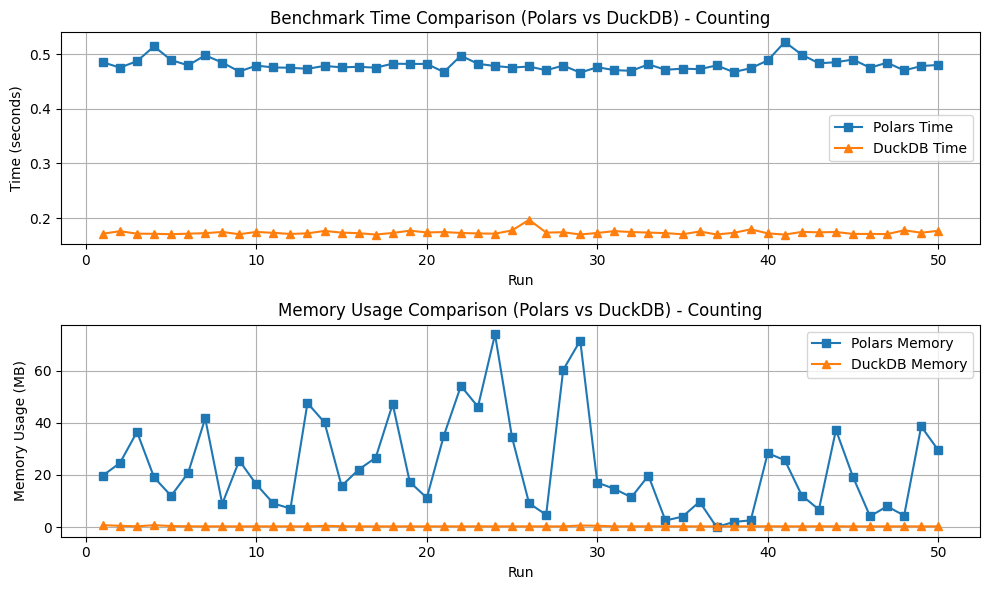

# Bioinformatics Data Processing: DuckDB and Polar on the BELKA Dataset

When it comes to biological datasets, it's very important to have data processing options that are fast, scalable, and low-cost. In this project, Polar and DuckDB are chosen to benchmark on the BELKA dataset using different data format (CSV and Parquet). The study shows that DuckDB works better than Polar when it comes to speed and memory usage. This is especially true in situations where big data tools like Apache Spark are too expensive and complicated to use. The goal is to find useful ways to handle big biological information without the extra work that comes with regular Big Data systems.

**Target Audience:**
Data engineers, bioinformaticians, database architects interested in efficient data processing solutions, especially those working with biological and scientific datasets where Big Data infrastructure may be excessive.
 
**Reference:** 
- https://www.kaggle.com/competitions/leash-BELKA/overview
- https://duckdb.org/
- https://pola.rs/

# Installation
```bash
# setup kaggle
# https://github.com/Kaggle/kaggle-api/blob/main/docs/README.md
# content: {"username":"your_name","key":"your_key"}
$KAGGLE_CONFIG_DIR/kaggle.json

# start download
kaggle competitions download -c leash-BELKA

# uncompress file
unzip leash-BELKA.zip -d leash-BELKA

```

## Performance Benchmarking of Polars vs DuckDB on BELKA Dataset

### Objective:
The notebooks aim to benchmark the performance of Polars and DuckDB on the BELKA dataset across two different data formats: **CSV** and **Parquet**. The key areas of comparison are:

1. **Time taken** from basic operations like counting records to complex queries such as filtering, grouping and sorting.
2. **Memory consumption** during these operations.

### Data Formats Used:
- **CSV** (Comma Separated Values)
- **Parquet** (Efficient columnar format)

### Libraries Used:
- **Polars**: A high-performance DataFrame library implemented in Rust.
- **DuckDB**: An in-process SQL database management system focused on OLAP workloads.
- **Matplotlib**: For visualizing the results.

### Analysis Workflow:
1. **Load and Inspect Data:**
   - The dataset is loaded in both CSV and Parquet formats to analyze the differences in data processing time and memory usage.
   
2. **Benchmark Operations:**
   - **Counting Records**: A fundamental operation is performed on both CSV and Parquet formats using Polars and DuckDB.
   - **Complex queries**: Experiment filtering, grouping, and sorting on large dataset using Polars and DuckDB.
   
3. **Time and Memory Usage Comparison**:
   - The time taken for each operation and the memory consumed are recorded.
   
4. **Plot Results**:
   - The results are visualized to compare the performance of Polars and DuckDB in terms of time efficiency and memory usage.



### Key Findings:
- **DuckDB** consistently outperforms **Polars** in terms of time calculation for both CSV and Parquet file formats.
- **DuckDB** also shows better memory management, consuming less memory compared to Polars when processing large datasets.

### Conclusion:
This analysis suggests that **DuckDB** is a more efficient choice over **Polars** from basic to complex data operations on medium-to-large biological datasets, particularly when working with Parquet files. The findings are significant for bioinformatics practitioners who aim to avoid the complexities and costs associated with big data frameworks like Apache Spark.
